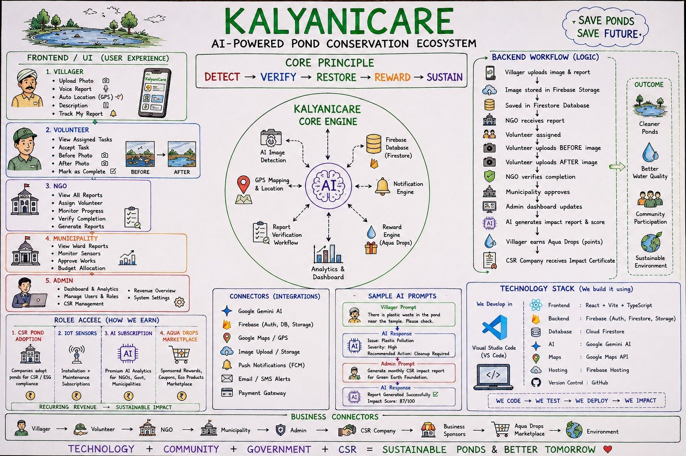

# KalyaniCare: AI-Powered Pond Conservation Platform

**Protecting Every Pond. Empowering Every Community.**

**Live app:** https://kcare-lemon.vercel.app
**Project page:** https://cosmolore.github.io/kalyanicare/

 

## The problem
Traditional village ponds (kalyanis) in Anekal Taluk are choking on toxic weeds and household greywater, with no organised way to track their health. Local youth groups want to restore them but lack a measurement framework, and CSR funds often go to short-term cosmetic clean-ups. Aligned with **SDG 14 (Life Below Water)**.

## What it does
**Detect → Verify → Restore → Reward → Sustain**
- Villagers report issues with photo, voice and auto GPS location
- Gemini AI detects and classifies the issue
- NGOs assign volunteers; volunteers upload before/after photos
- NGO verifies, municipality approves, AI generates an impact report and score
- Villagers earn Aqua Drops; CSR partners receive impact certificates

## Tech stack
React + Vite + TypeScript · Firebase (Auth, Firestore, Storage) · Google Gemini AI · Google Maps API · Vercel · GitHub

## Repository contents
This repository hosts the project showcase page (`index.html`) served with GitHub Pages.

## Team
Group 55 (AR), Aqua Re-imagine: *Beyond Conservation, Towards Transformation*
